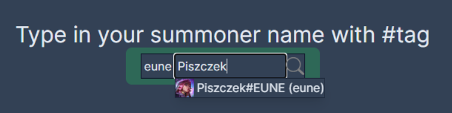
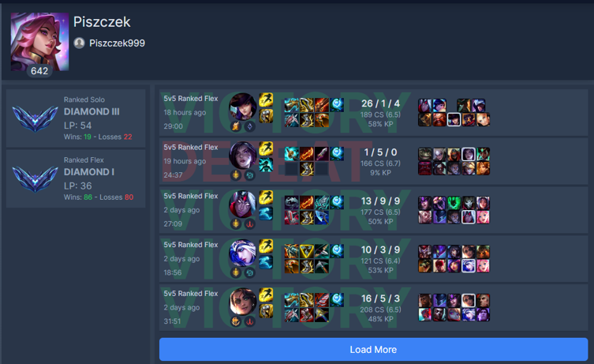

# LoL Match Tracker


---

## Overview

LoL Match Tracker is a web application that allows users to search for **League of Legends** players and view their in-game statistics, match history, and ranked progression.

The application provides a clear and structured overview of a player’s performance, including detailed match data and overall ranking information.

---

## Features

* Search League of Legends players by nickname
* View player profile and ranked information
* Display match history
* View detailed statistics for individual matches
* Responsive and fast UI optimized for real-time lookup

---

## Tech Stack

* Next.js
* TypeScript
* Supabase (backend & data storage)
* Vercel (deployment)

---

## Installation

```bash id="inst1"
npm install
```

---

## Environment Variables

Create a `.env.local` file based on `.env.local.example`.

Required variables typically include:

* Supabase URL
* Supabase anon key
* Riot API key

---

## Running Locally

```bash id="dev1"
npm run dev
```

Application will be available at:

```text id="dev2"
http://localhost:3000
```

---

## Screenshots

### Player Search

Search interface for finding League of Legends players by nickname.



---

### Player Details

Displays ranked information, match history, and detailed match statistics.



---

## Project Purpose

This project was developed as a portfolio piece to demonstrate:

* Integration with external gaming data (Riot Games API)
* Full-stack development using Next.js
* Database-backed application using Supabase
* Real-time data fetching and presentation
* Clean UI design for analytical dashboards

---

## License

Portfolio / educational project.
